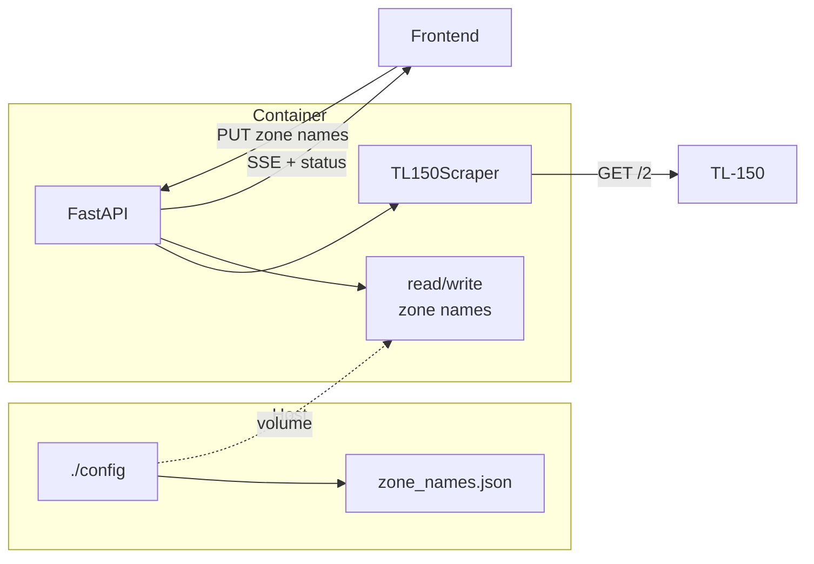

# DSC TL-150 PWA

A lightweight Progressive Web Application (PWA) you run as a Docker container to control a DSC alarm panel with a TL-150 network/command board. Works on your local network and over VPN—no cloud, no subscription.

---

## Background

I created this application because I do not believe in having "cloud managed" access to my home security panel. For years I was using a 3rd party, paid app on the iPhone to control my DSC alarm panel with a TL-150 network/command board. Since the latest iOS 26+ they have stopped developing the application. I created this lightweight progressive application (PWA) to work with a wired DSC alarm panel with a TL-150 board.

---

## Requirements

- **DSC Alarm Panel** — Wired PowerSeries panel compatible with the TL-150
- **TL-150 Communication Board** — Ethernet module that exposes the panel on your LAN via its built-in web interface
- **A home private network** — TL-150 and Docker host must be on the same LAN (or reachable via VPN)
- **A Docker server** — Any Linux (or other) host running Docker and Docker Compose

---

## Architecture

The PWA runs as a **single Docker container**:

| Layer | Technology | Role |
|-------|------------|------|
| **Frontend** | SvelteKit (adapter-static) | Single-page UI: one clickable status circle (Ready + Arm, or Armed + Disarm), zones in 2 columns with editable names and green/red status. Built to static HTML/JS/CSS at image build time. |
| **Backend** | FastAPI (Python) | Serves static app, REST API (`/api/config`, `/api/status`, `/api/arm/stay`, `/api/disarm`, `/api/zone-names`), and Server-Sent Events (`/api/events`) for real-time updates. |
| **Scraper** | httpx + BeautifulSoup | Polls the TL-150’s HTTP interface (no official API); parses HTML to read arm state and zones, and sends arm/disarm via GET with PIN. |
| **Config** | Host-mounted volume | `./config` holds **`.env`** (security: TL-150 credentials + PIN), **`settings.txt`** (app logic: zones list, layout, titles, poll, arm mode, etc.), and **`zone_names.json`** (custom zone labels only). See `dsc-panel/config/README.md`. No rebuild needed for most changes. |

- The backend polls the TL-150 every 10 seconds (configurable) and pushes status to all connected browsers over SSE.
- Arm/Disarm: one clickable circle—click to arm (stay) or disarm; no separate buttons. The circle shows “Ready” + “Arm” when disarmed, “Armed” + “Disarm” when armed.
- **App logic** → `config/settings.txt` (JSON; copy from `settings.txt.example`): zone list, columns, titles, poll interval, arming countdown UI, default arm mode, etc.
- **Security / panel access** → `config/.env`: `DSC_HOST`, `DSC_USER`, `DSC_PASS`, `DSC_PIN` only.
- **Custom zone names** → `config/zone_names.json` (copy from `zone_names.json.example` or edit in the app UI). See `dsc-panel/config/README.md` for the full split.

---

## Data flow



---

## Setup and run

### 1. Clone or copy the project

Ensure the `dsc-panel` directory (with `Dockerfile`, `docker-compose.yml`, `backend/`, `frontend/`) is on the machine that will run Docker.

### 2. Create the config directory and `.env`

```bash
cd dsc-panel
mkdir -p config
cp config/.env.example config/.env
cp config/settings.txt.example config/settings.txt
# optional: seed zone labels (strict JSON — no trailing comma on the last line)
cp config/zone_names.json.example config/zone_names.json
```

Edit `config/.env` (credentials only):

- `DSC_HOST` — TL-150’s IP on your LAN (e.g. `192.168.1.10`)
- `DSC_USER` — Usually `admin`
- `DSC_PASS` — TL-150 web interface password
- `DSC_PIN` — Your panel keypad PIN (used for arm/disarm)

Edit `config/settings.txt` for app logic: titles, `zone_list`, `poll_secs`, `arming_countdown_secs`, `zone_columns`, `default_arm_mode`, etc. Custom zone **names** live in `config/zone_names.json` (or edit in the UI). See `dsc-panel/config/README.md`.

### 3. Build and start the container

```bash
docker compose up -d --build
```

### 4. Check that it’s running

```bash
docker compose ps
docker compose logs --tail=50
curl -s http://localhost:8000/api/status | head -c 200
```

Open **http://\<your-server-ip\>:8000** in a browser (or over VPN). You should see the status circle (click to arm or disarm), date/time, and zones in a grid (`zone_columns` in `settings.txt`). Click a zone **name** to edit its label (blur or Enter to save). Click a zone **number** or the **green/red dot** to see when it was last closed.

### 5. Changing PIN, password, or panel options later

Edit **`config/.env`** (security / TL-150 access), **`config/settings.txt`** (app logic), or **`config/zone_names.json`** (custom zone labels), then:

```bash
docker compose restart
```

No image rebuild is required.

### 6. Install as PWA on a phone

- **iPhone:** Safari → open the app URL → Share → **Add to Home Screen**
- **Android:** Chrome → open the app URL → menu → **Add to Home Screen** / **Install App**

---

## UI overview

- **Status circle** — One control: when disarmed it shows “Ready” and “Arm” inside the ring; when armed it shows “Armed” and “Disarm”. Click the circle to arm (stay) or disarm. While arming, the circle shows “Arming” and is disabled.
- **Zones** — Grid column count comes from `zone_columns` in `settings.txt`. Each row has zone number, editable name, and a green (closed) or red (open) status dot.
- **Zone name** — Click the name to edit; blur or press Enter to save (a brief “Saved” appears).
- **Last activity** — Click the zone number or the status dot to show when that zone was last closed (e.g. “CLOSED: 4 Minutes Ago”). Click again to hide.
- **App title / zone list / layout / arm mode** — `config/settings.txt`. **Custom zone names** — `config/zone_names.json` or the UI.

---

## Docker Compose: external data directory (best practices)

Keeping config and data outside the container (and optionally outside the project) gives you:

- **No rebuilds** when you change PIN, password, or zone names
- **Easy backups** — one directory to copy or snapshot
- **No secrets in the image** — `.env` stays on the host
- **Survives** `docker compose down` and image rebuilds

### Option A: Data directory inside the project (default)

This repo uses a **project-relative** path so everything stays under `dsc-panel/`:

```yaml
volumes:
  - ./config:/app/config
env_file:
  - ./config/.env
```

- **Pros:** Simple, one folder to clone/copy.  
- **Cons:** Data lives with the app; if you delete or move the repo, you must move `config/` too.

### Option B: External data directory (recommended for servers)

Use a **fixed path** on the host that is not inside the project. That way you can replace or re-clone the app without touching data.

**1. Choose a host path.** Examples:

- `/opt/dsc-panel/config`
- `~/docker-data/dsc-panel/config`
- `/var/lib/dsc-panel/config`

**2. Create the directory and copy the template:**

```bash
sudo mkdir -p /opt/dsc-panel/config
sudo cp dsc-panel/config/.env.example /opt/dsc-panel/config/.env
sudo chown -R "$USER:$USER" /opt/dsc-panel   # or the user that runs Docker
```

**3. Edit `docker-compose.yml`** to point at that path:

```yaml
services:
  dsc-panel:
    # ...
    volumes:
      - /opt/dsc-panel/config:/app/config
    env_file:
      - /opt/dsc-panel/config/.env
```

**4. Edit the env file and run:**

```bash
nano /opt/dsc-panel/config/.env   # set DSC_HOST, DSC_PASS, DSC_PIN, etc.
cd dsc-panel
docker compose up -d --build
```

From then on, all config and zone names live under `/opt/dsc-panel/config`. You can backup that directory, change PIN/password there, and restart the container without rebuilding.

**PWA icons:** The app serves favicon and PWA icons from `config/icons/`. When using an external config path, put your icon files in that directory so the container sees them at `/app/config/icons/`. Example with a host config under your home directory:

```bash
# Example: config at ~/docker-data/dsc-panel/config
mkdir -p ~/docker-data/dsc-panel/config/icons
cp dsc-panel/config/.env.example ~/docker-data/dsc-panel/config/.env
# Add your own icons (e.g. icon-16x16.png … icon-512x512.png, icon-maskable-512.png, apple-touch-icon.png)
# Then in docker-compose.yml or docker-compose.override.yml:
#   volumes:
#     - /home/YOUR_USER/docker-data/dsc-panel/config:/app/config
#   env_file:
#     - /home/YOUR_USER/docker-data/dsc-panel/config/.env
```

The app serves whatever PNGs (and optional `favicon.ico`) you place in `config/icons/`; the manifest and page link to `/icons/icon-32x32.png`, `/icons/apple-touch-icon.png`, etc.

### General best practices

| Practice | Why |
|----------|-----|
| **Never put secrets in the image** | Use `env_file` (e.g. `config/.env`) or env vars; keep `.env` out of git. |
| **One directory per app** | e.g. `/opt/dsc-panel/config` or `~/docker-data/dsc-panel/config` so backups and permissions are clear. |
| **Ownership** | If the process in the container runs as root, the host dir can be root-owned; if it runs as a user, `chown` the host dir to match (or a group that can access it). |
| **Backup the data dir** | Periodically copy or snapshot the config directory (e.g. `tar czf dsc-panel-config.tar.gz /opt/dsc-panel/config`). |
| **Add `config/.env` to `.gitignore`** | So credentials are never committed. This repo expects config in `config/`; if you use an external path, ignore that path in your own backup/exclusion lists. |

### Quick reference: override for an external path

If you prefer not to edit `docker-compose.yml`, use an override file. Create `docker-compose.override.yml` in the same directory:

```yaml
services:
  dsc-panel:
    volumes:
      - /opt/dsc-panel/config:/app/config
    env_file:
      - /opt/dsc-panel/config/.env
```

Docker Compose merges this with `docker-compose.yml` automatically. Ensure `/opt/dsc-panel/config/.env` exists and is populated before `docker compose up`.

---

## Project layout

```
dsc-panel/
├── Dockerfile              # Multi-stage: Node (SvelteKit build) → Python (FastAPI + static)
├── docker-compose.yml      # Single service; mounts config, uses config/.env
├── config/
│   ├── .env.example        # Template for config/.env
│   ├── .env                # Your secrets (create from .env.example)
│   ├── icons/              # PWA icons (optional; icon-16x16.png … icon-512x512.png, apple-touch-icon.png)
│   ├── settings.txt.example
│   ├── settings.txt        # App logic (copy from example; must be valid JSON)
│   ├── zone_names.json.example
│   └── zone_names.json     # Custom zone names (optional; copy from example or use UI)
├── backend/
│   ├── main.py             # FastAPI app, SSE, zone names, status
│   ├── scraper.py          # TL-150 HTTP client and HTML parser
│   └── requirements.txt
└── frontend/               # SvelteKit app (built into static in image)
    └── src/routes/+page.svelte
```

For more detail (TL-150 protocol, API, and design notes), see [PROJECT_GOAL.md](PROJECT_GOAL.md).
