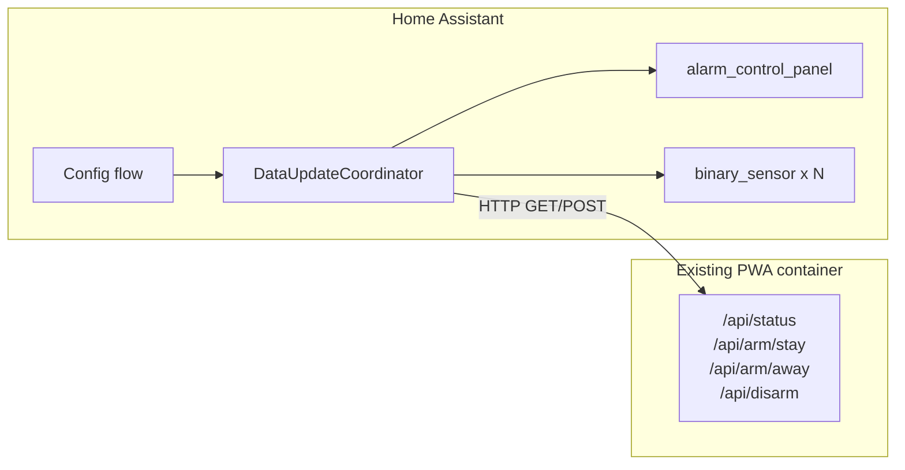

# Home Assistant Integration for DSC TL-150 PWA

## Approach: Integration as a separate module, PWA unchanged

The standalone PWA stays as-is. The integration is a **custom component** that communicates with the PWA over HTTP using the existing REST API. Users copy the integration folder into their Home Assistant `custom_components/` directory and add the integration via **Settings → Devices & Services → Add Integration**. No changes to the Docker image or backend are required; the current API is sufficient.



---

## 1. Where the integration lives in this repo

- **New directory**: `homeassistant/dsc_tl150_pwa/` (or `ha-integration/dsc_tl150_pwa/`) at the repo root.
- **Installation**: User copies the contents of `dsc_tl150_pwa/` into their HA config: `config/custom_components/dsc_tl150_pwa/`.
- **Docs**: Add a short "Home Assistant" section to README.md with install steps and link to this integration.

This keeps the PWA under `dsc-panel/` untouched and makes the HA integration an optional, copy-paste module.

---

## 2. PWA API usage (no backend changes)

The integration will use only existing endpoints:

| HA need         | PWA endpoint         | Notes                                                                                                                                        |
| --------------- | -------------------- | -------------------------------------------------------------------------------------------------------------------------------------------- |
| Status + zones  | `GET /api/status`    | Returns `armed`, `arm_mode` ("stay"/"away"), `ready`, `trouble`, `zones[]` with `number`, `name`, `state` ("open"/"closed"), `last_activity` |
| Disarm          | `POST /api/disarm`   | No body/PIN in current API                                                                                                                   |
| Arm stay (home) | `POST /api/arm/stay` |                                                                                                                                              |
| Arm away        | `POST /api/arm/away` |                                                                                                                                              |

The PWA does not expose a PIN in the API (PIN is in `.env` on the server). The integration can set the alarm_control_panel to **code_arm_required = False** so HA does not prompt for a code, matching current PWA behavior. Optional later: add an optional code in config flow and, if desired, a small optional API change (e.g. header or body) to pass code for disarm.

---

## 3. Home Assistant integration structure

Standard [custom integration file structure](https://developers.home-assistant.io/docs/creating_integration_file_structure/):

```
homeassistant/dsc_tl150_pwa/
├── manifest.json
├── __init__.py
├── config_flow.py
├── coordinator.py          # DataUpdateCoordinator polling GET /api/status
├── const.py               # DOMAIN, CONF_BASE_URL, etc.
├── alarm_control_panel.py  # AlarmControlPanelEntity
├── binary_sensor.py        # one BinarySensorEntity per zone
├── strings.json
└── translations/          # optional: en.json
```

**manifest.json**

- `domain`: `"dsc_tl150_pwa"`
- `name`: `"DSC TL-150 PWA"`
- `version`: e.g. `"1.0.0"`
- `config_flow`: true
- `requirements`: `["httpx"]` (or `aiohttp` if preferred)
- `documentation`: link to this repo's README

**config_flow.py**

- Single step: **Base URL** (e.g. `http://neutral:8000` or `http://192.168.1.10:8000`), optional **Name**.
- Validation: `GET {base_url}/api/status`; on success create the config entry with base URL and optional name.
- No credentials in the flow (PWA is assumed on a trusted network).

**coordinator.py**

- `DataUpdateCoordinator` that periodically (e.g. every 10–15 s) calls `GET {base_url}/api/status`.
- Parses JSON and exposes: `armed`, `arm_mode`, `ready`, `trouble`, `zones` (list with `number`, `name`, `state`, `last_activity`).
- Handles connection errors and marks entities unavailable on failure.

**alarm_control_panel.py**

- One entity per config entry (one panel).
- State mapping: PWA `armed=false` → `DISARMED`; `armed=true` and `arm_mode="stay"` → `ARMED_HOME`; `arm_mode="away"` → `ARMED_AWAY`.
- Implement:
  - `async_alarm_disarm(code=None)` → `POST /api/disarm`
  - `async_alarm_arm_home(code=None)` → `POST /api/arm/stay`
  - `async_alarm_arm_away(code=None)` → `POST /api/arm/away`
- Set `code_arm_required = False` (and appropriate `code_format`) unless you later add code support.
- Use coordinator data for state; no local state cache beyond coordinator.

**binary_sensor.py**

- One `BinarySensorEntity` per zone from coordinator data.
- `state`: "on" when zone `state == "open"`, "off" when "closed" (device_class e.g. `door` or `opening`).
- `name`: use zone `name` from API (or "Zone {number}").
- Unique_id: e.g. `{entry_id}_zone_{number}` so they survive reconfig.

**__init__.py**

- `async_setup_entry`: create coordinator, start it, forward to `alarm_control_panel.async_setup_entry` and `binary_sensor.async_setup_entry`.
- `async_unload_entry`: cancel coordinator, unload platforms.

**strings.json**

- `config.step.user.data.base_url` / `name` and descriptions (e.g. "Base URL of your DSC PWA (e.g. http://host:8000)").

---

## 4. Optional: small PWA backend tweaks (only if needed)

- **Health/version**: Not required for the integration; `GET /api/status` is enough to validate and poll. You could add `GET /api/health` later for clarity.
- **PIN/code**: To support "code required" in HA later, you could add an optional `Authorization` header or JSON body `{"code": "..."}` to `POST /api/disarm` (and optionally arm) and validate against `DSC_PIN`; skip if not provided. Not in initial scope.

---

## 5. Location-based auto arm/disarm (in HA, not in this repo)

Once the integration is installed:

- **Device**: One alarm_control_panel entity (e.g. `alarm_control_panel.dsc_tl150_pwa`) and N zone binary_sensors.
- **Automations**: User creates HA automations using:
  - **Device tracker / zone**: e.g. "when `person.me` leaves zone `zone.home`" → call `alarm_control_panel.alarm_arm_away` (or arm_home); "when `person.me` enters `zone.home`" → `alarm_control_panel.alarm_disarm`.
- No code in the integration or PWA for "location aware" — it's standard HA automation using the new entities.

Document this in the README (e.g. "You can use HA's person/zone triggers to arm when leaving and disarm when arriving").

---

## 6. Implementation order

1. Add `homeassistant/dsc_tl150_pwa/` with `manifest.json`, `const.py`, `strings.json`.
2. Implement `config_flow.py` (base URL + validation via `/api/status`).
3. Implement `coordinator.py` (fetch status, parse, expose to platforms).
4. Implement `__init__.py` (setup/unload, coordinator, platform discovery).
5. Implement `alarm_control_panel.py` (state + arm/disarm/arm_stay/arm_away).
6. Implement `binary_sensor.py` (one entity per zone from coordinator).
7. Add README section: install (copy to `custom_components`), add integration, optional location automation example.
8. Manual test: add integration in HA, verify alarm state and zone sensors, trigger arm/disarm from HA, then build a simple leave-home / arrive-home automation.

---

## 7. Summary

| Item                 | Action                                                                                          |
| -------------------- | ----------------------------------------------------------------------------------------------- |
| PWA (dsc-panel)      | No code changes; existing API is used as-is.                                                    |
| Repo layout          | New folder `homeassistant/dsc_tl150_pwa/` (or `ha-integration/...`) with full custom component. |
| Config               | Config flow: base URL (+ optional name). No PIN in first version.                               |
| Entities             | 1 alarm_control_panel (arm/disarm, arm stay, arm away) + N binary_sensors (zones).              |
| Updates              | Coordinator polls `GET /api/status` every 10–15 s.                                              |
| Location automations | Done in HA UI using the new entities; document in README.                                       |

This keeps the standalone app unchanged and delivers a separate, enable-only HA module that supports commands and status and enables location-based arm/disarm in Home Assistant.
